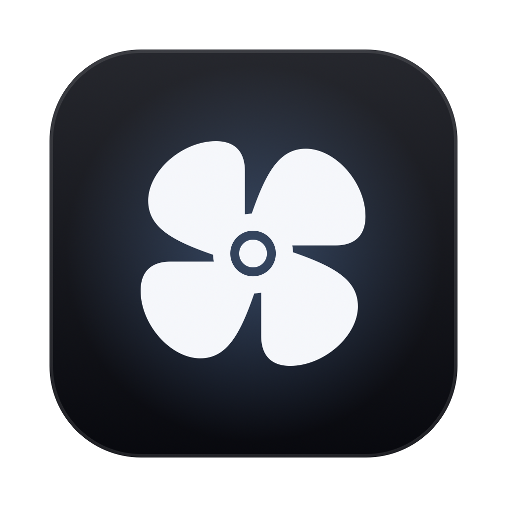
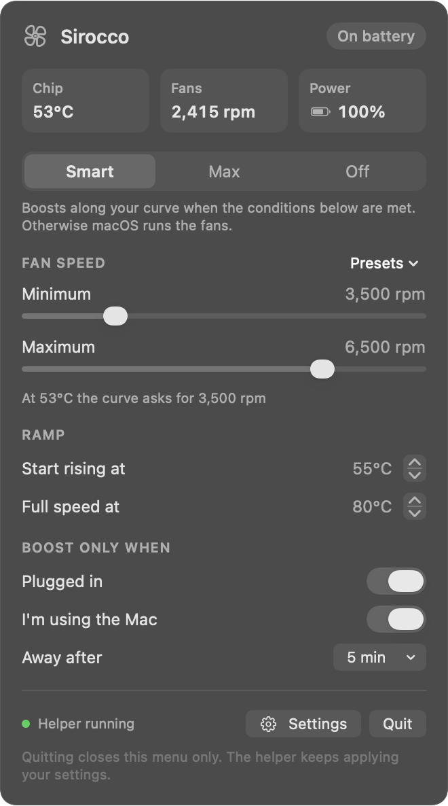

<p align="center">
  
</p>

<h1 align="center">Sirocco</h1>

<p align="center">
  Fan control for Apple silicon Macs that only steps in when it helps.
</p>

<p align="center">
  <a href="https://github.com/joymadhu49/Sirocco/releases/latest"></a>
  <a href="https://github.com/joymadhu49/Sirocco/actions/workflows/ci.yml"></a>
  <a href="LICENSE"></a>
</p>

A MacBook keeps its fans near minimum until the chip is hot, so under steady work the case soaks up the heat and gets uncomfortable to touch. Sirocco spins the fans up earlier, on a curve you set, while you're plugged in and using the Mac. The rest of the time macOS runs the fans as it always does.

<p align="center">
  
</p>

## Features

- **Smart mode.** Fans follow your curve as the chip warms up, but only on power and while you're at the Mac.
- **Your limits.** Minimum and maximum speed, where the ramp starts and ends, and how long counts as away.
- **Presets.** Quiet, Balanced and Cool, scaled to your Mac's fan range.
- **Max and Off.** Pin the fans at your maximum, or hand them back to macOS.
- **Menu bar.** A fan icon that spins with the real fans, with optional temperature and speed.
- **Automatic updates**, signed and verified.

## Install

Requires Apple silicon, fans, and macOS 13 or later.

1. Download the latest `.dmg` from [Releases](https://github.com/joymadhu49/Sirocco/releases/latest).
2. Drag **Sirocco** into Applications and open it.
3. Click **Open System Settings** and switch on **Sirocco** under Allow in the Background. This is needed once.

The app is signed and notarized by Apple.

## How it works

Changing fan speeds needs root, so Sirocco is two parts: the app, which runs as you, and a small helper inside it that runs as root and does nothing but drive the fans. They talk over XPC and each checks the other's code signature.

The helper is built to fail safe:

- Settings are clamped to the range your fans report.
- Above 95°C the fans go to full speed whatever your settings say.
- When it stops, for any reason, it hands the fans back to macOS first.

Sirocco collects nothing. Its only network request is the update check.

## Uninstall

In Sirocco, open **Helper**, then **Troubleshooting**, and click **Remove**. Then drag Sirocco to the Trash.

## Build from source

```sh
brew install xcodegen create-dmg
bash Scripts/build.sh --install
```

Fan control only works in a build signed with a Developer ID. A fork sets its team ID in `Sources/Shared/Identity.swift` and its bundle identifiers in `project.yml`.

## License

[MIT](LICENSE)
